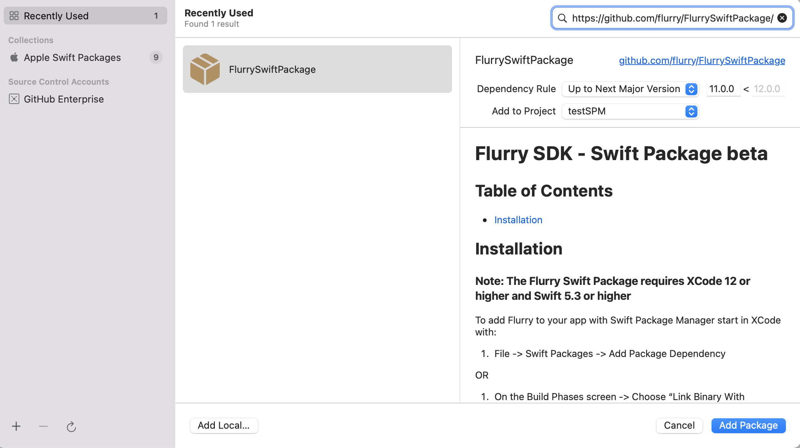

# Flurry SDK - Swift Package 

## Table of Contents

- [Installation](#installation)

## Installation

#### Note: The Flurry Swift Package requires XCode 12 or higher and Swift 5.3 or higher

To add Flurry to your app with Swift Package Manager start in XCode with:

1. File -> Swift Packages -> Add Package Dependency 

OR

1. On the Build Phases screen -> Choose "Link Binary With Libraries" -> Click "+" -> Choose "Add Other" -> Choose "Add Package Dependency"

2. Enter the following repo in the url section: **https://github.com/flurry/FlurrySwiftPackage/**

3. You should see the following: 

Choose the version option to get the latest version. 11.1.0 is currently the only version available as a swift package.

4. Click "Next" and the following page should appear:

5. Choose the Packages needed for your project. 

  *Note: Flurry Analytics is required to use FlurryAds, FlurryConfig and FlurryMessaging.

6. The Flurry Analytics Swift Package requires the System Configuration framework (SystemConfiguration.framework).

  a. On the Build Phases page, under "Link Binary With Libraries", click on "+" and add "SystemConfiguration.framework"

7. If you are using Objective C proceed with the integration instructions [here](https://developer.yahoo.com/flurry/docs/integrateflurry/ios/#initialize-flurry):

[https://developer.yahoo.com/flurry/docs/integrateflurry/ios/#initialize-flurry](https://developer.yahoo.com/flurry/docs/integrateflurry/ios/#initialize-flurry)

8. A bridging header is no longer required when using Flurry's Swift Package. You can import Flurry_iOS_SDK as documented here: https://gist.github.com/flurrydev/d3351c757b41944d04609038439d4992#file-initializeflurrylongform-swift
